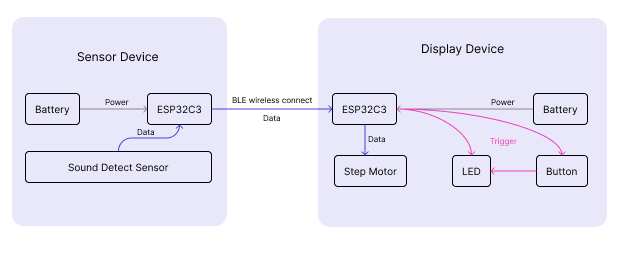
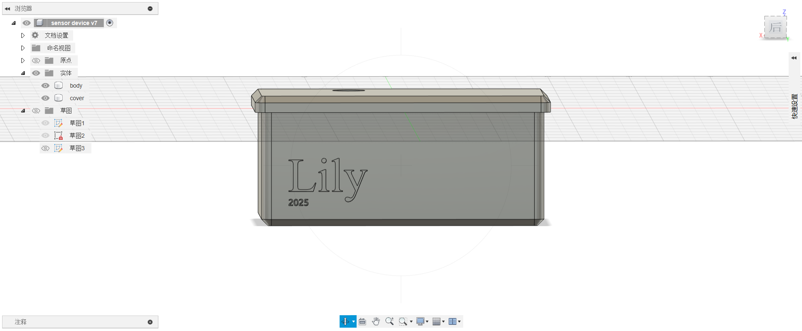
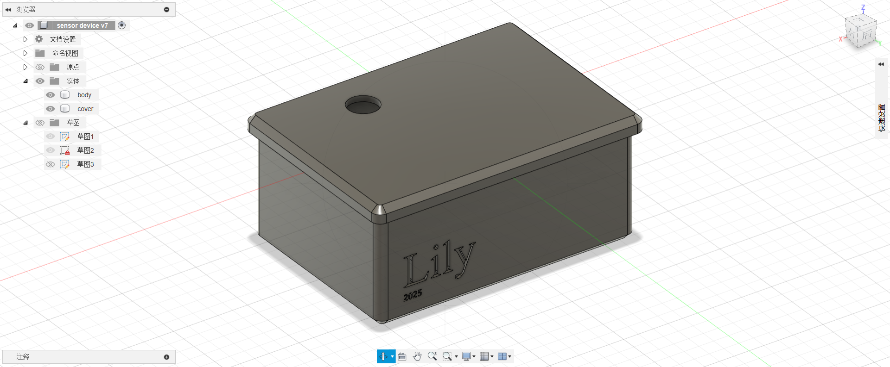
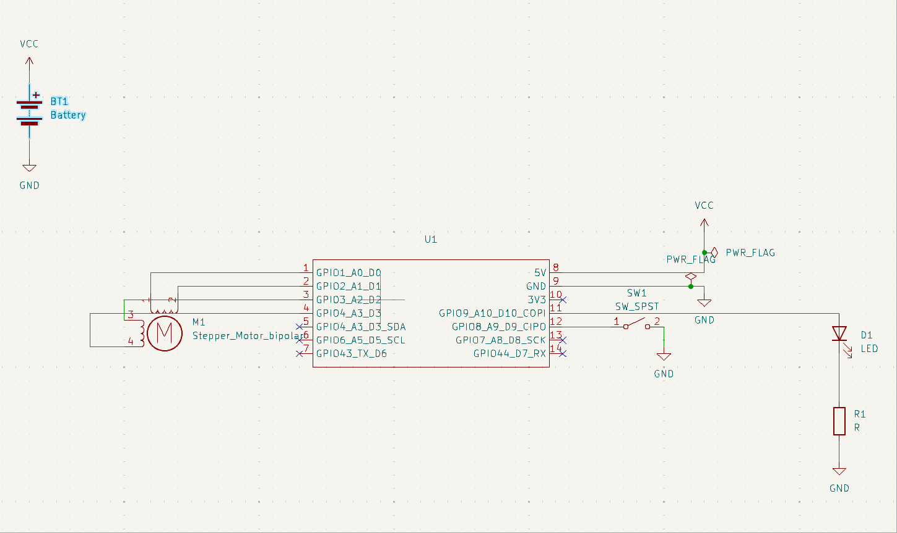
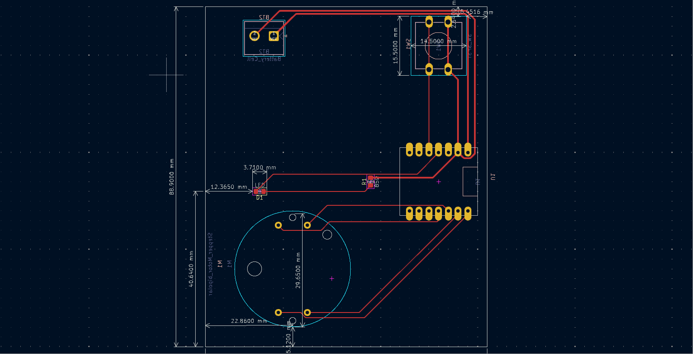
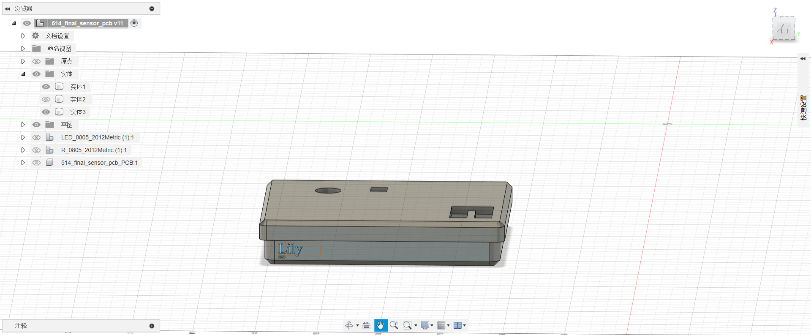
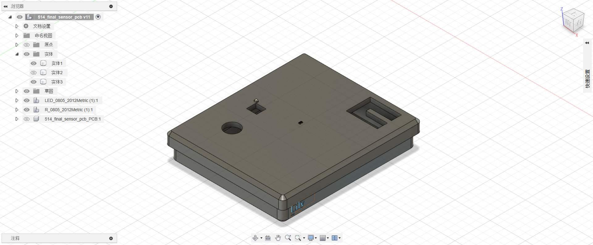

# 514-Finalproject--Sound Detector in Clubs

# Current Situation
In many clubs, loud and intense music is commonly played to create an energetic atmosphere that helps people relax. However, to enhance this effect, DJs often push the volume to high levels, which can pose serious risks to hearing health. Specifically, prolonged exposure to noise levels of 70-85 dB (e.g., vacuum cleaners) may cause mild hearing damage, levels above 85 dB (e.g., heavy traffic) can harm hearing after 8 hours, exposure to 100 dB (e.g., noisy nightclubs) can affect hearing within 15 minutes, and noise exceeding 120 dB (e.g., airplane engines) poses an immediate risk of permanent damage.

# Proposed Solution
Our project aims to address this issue by using a sound detection sensor that monitors noise levels in clubs. This device will transmit data wirelessly to dispaly device, which visualizes the information using a step motor. When the sound level above the baseline, The system alters DJs, helping to protect people from potential hearing damage. 

## System Architecture
The system includes two devices(sensor device & display device), sensor device use MAX4466 to detect soudn level and transmit it to display device wirelessly through ESP32C3. When the display device recieve data, it will visualize the information through Step motor x27. Also, if the sound level excess the baseline, the LED will turn on to alter people. The button can turn off the light.
 

## Sensor Device Components  
The sensor device includes a ESP32C3, a sound level detect sensor MAX4466 and a 3.7V 700mAh battery.

## Sensor Device Enclosure
Since the MAX4466 needs microphone to detect data, the enclosure of the sensor device needs a space for microphone to recieve sound data.
  
 

## Display Device Components  
The display device includes a ESP32C3, a step motoir x27, a LED, a resistor, a button and a 3.7V 700mAh battery.

## Display Device PCB Design
The ESP32C3 recieve data and send it to step motor and LED. Also, command step motor to visualize the information and control the LED through data and the button.

## Display Device Enclosure
The display device needs a window to show the LED light and need a function to push the button. Also, the enclosure should explain the step motor's visulaization.

## Device communicate  
Materials: sound sensor, PCB, button, battery, gauge, color-coded LED  
Connection: Use PCB to connect and control all the materials. Input sound sensor signals and output different points to gauge, also different color to LED. Use a button to control power from the battery that supplies this device.  
Algorithms:  DSP algorithm to process sound signals  

