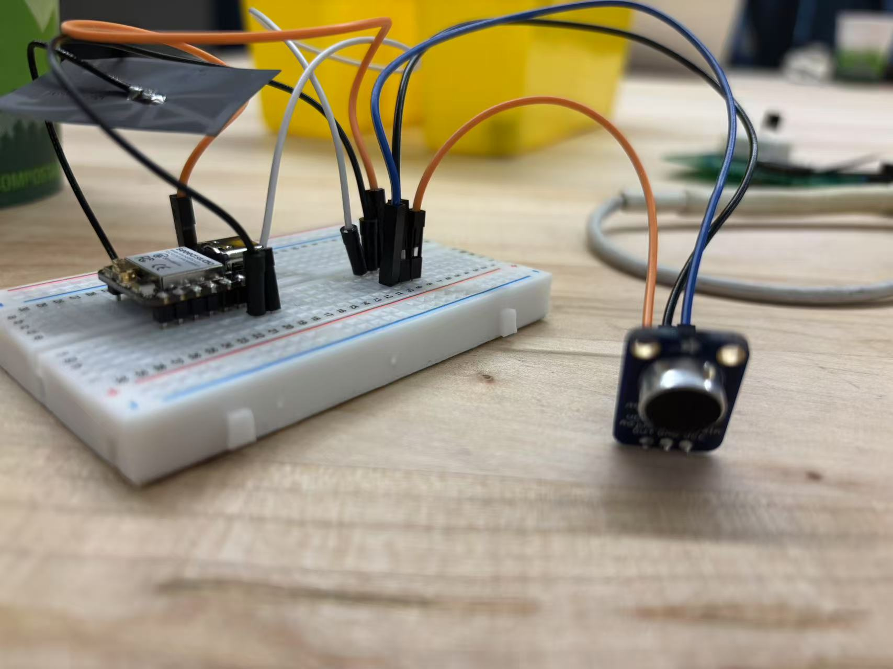

# 514-Finalproject

# Current Situation
In many clubs, loud and intense music is commonly played to create an energetic atmosphere that helps people relax. However, to enhance this effect, DJs often push the volume to high levels, which can pose serious risks to hearing health. Specifically, prolonged exposure to noise levels of 70-85 dB (e.g., vacuum cleaners) may cause mild hearing damage, levels above 85 dB (e.g., heavy traffic) can harm hearing after 8 hours, exposure to 100 dB (e.g., noisy nightclubs) can affect hearing within 15 minutes, and noise exceeding 120 dB (e.g., airplane engines) poses an immediate risk of permanent damage.

Our project aims to address this issue by using a sound detection sensor that monitors noise levels in clubs. This device will transmit data wirelessly to dispaly device, which visualizes the information using a step motor. When the sound level above the baseline, The system alters DJs, helping to protect people from potential hearing damage. 

**##System Architecture**
  

##Physical sketch  
  

#Sensor Sketch and Picture  
I want to use** SparkFun Sound Detector **to detect the sound level. Put this sensor in the device and guide the gauge to show sound level. If the level over the setting value, turn on the LED to give people a reminder.  

#Display Sketch  
Put the device on the room that holds parties to monitor the environment sound level. If the noise too load, the LED will turn on and give reminder to people they might interup their neibours. Also, people can see the current sound level by watching the guage needle on the device.  

#Device communicate  
Materials: sound sensor, PCB, button, battery, gauge, color-coded LED  
Connection: Use PCB to connect and control all the materials. Input sound sensor signals and output different points to gauge, also different color to LED. Use a button to control power from the battery that supplies this device.  
Algorithms:  DSP algorithm to process sound signals  

